# Capstone Overview

This capstone requires you to perform a full penetration test in a capture-the-flag format. 
You’ll start with reconnaissance, exploit vulnerabilities to access hidden flag files, report 
the flags found, and propose remediation strategies to strengthen security.

Capstone can only be completed after finding all the flags files in:
- **Challenge 1** – Use SQL injection to find a flag file.
- **Challenge 2** – Use web server vulnerabilities to investigate
  directories and find a flag file.
- **Challenge 3** – Exploit open Samba shares to access a flag file.
- **Challenge 4** – Analyze a Wireshark capture file to find the
  location of a file containing flag information.

# Background / Scenario
- You have been hired to conduct a penetration test for a customer. At the
conclusion of the test, the customer has requested a complete report
that includes any vulnerabilities discovered, successful exploits, and
remediation steps to protect vulnerable systems. You have access to
hosts on the 10.5.5.0 and 192.168.0.0/24 networks.

# Prerequisites
- Knowledge of hacking tools and commands used in SQL Injection attacks, Web Server vulnerabilities and directory attacks, SMB Server Shares attacks and Packet and Traffic Capturing and Analysing.
- Knowledge of Linux terminal use and navigation.

# Required Resources
- Cisco's Kali VM customized for the Ethical Hacker course

# Guide

## Challenge 1: SQL Injection

#### _Objective:_
Discover user account information on a server and crack the password 
of **Bob Smith's** account. Then locate the file with Challenge 1 code 
and use **Bob Smith's** account credentials to open the file at 192.168.0.10 to view its contents.

### Step 1: Initial setup

1.  From the Kali VM Open a browser and go to the website at 10.5.5.12.

***Note:*** If you have problems reaching the website, remove the https://
prefix from the IP address in the browser address field.

2.  Login with the credentials **admin / password**.

    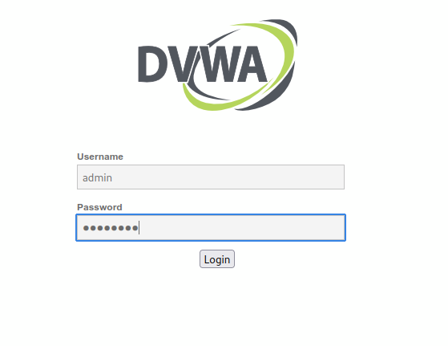

3.  Set the DVWA security level to **low** and click **Submit**.
   _(Security level can be set to match your level of expertise and skill but for the 
sake of this particular lab, it is limited to **low**)_

    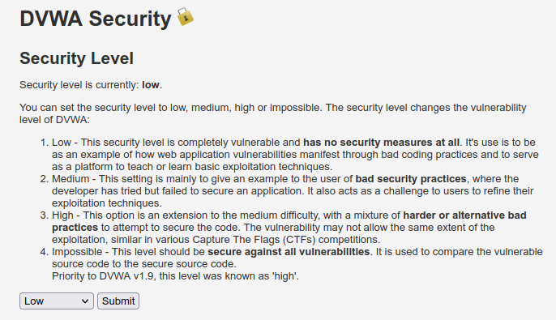

###  Step 2: Retrieve the user credentials for the Bob Smith’s account.

1.  Identify the table that contains usernames and passwords.

2.  Locate a vulnerable input form that will allow you to inject SQL
    commands.

    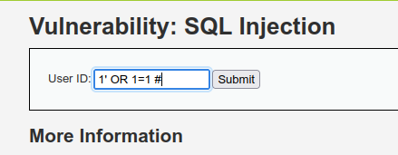

    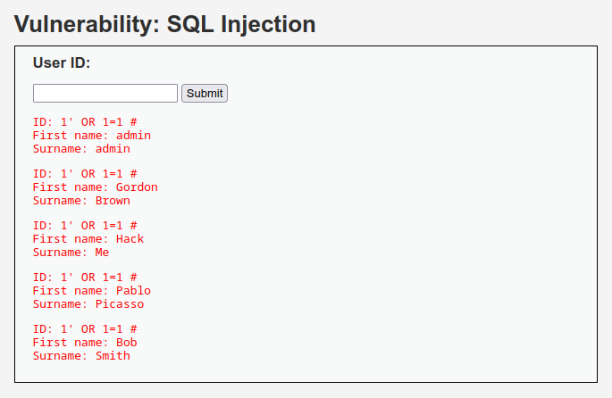

    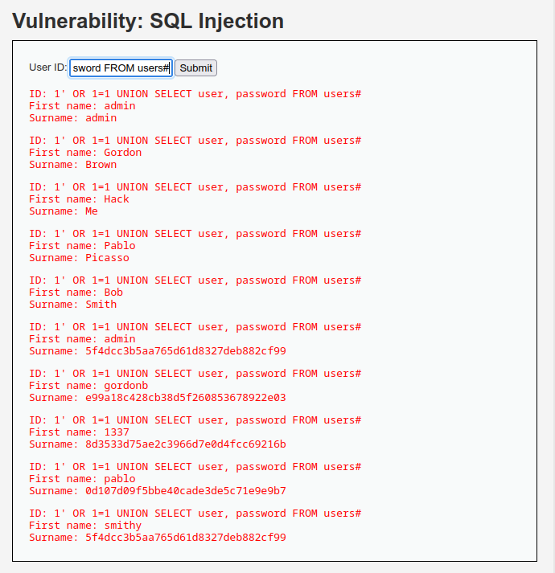

3.  Retrieve the username and the password hash for **Bob Smith's**
    account.

    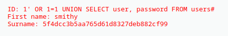

### Step 3: Crack Bob Smith’s account password.

Use any password hash cracking tool desired to crack **Bob Smith**’s
password.
_(In this case, the free Password Hash Cracker on the **Crack Station** website was used)_
`Alternate password hash crackers could be John the Ripper`

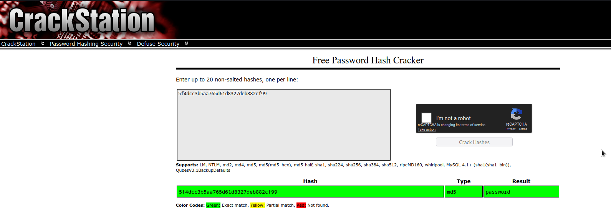

#### Challenge checkpoint 1
- The password for **Bob Smith’s account** is "**`password`**" .

### Locate and open the file with Challenge 1 code.

1.  Log into **192.168.0.10** as **Bob Smith**.
```ssh_connection
ssh smithy@192.168.0.10

# An alternative way will be to log into Bob Smith account from the web app but that doesn't reveal the flag code.
```

```next_step
# Enter Bob's password when prompted

< Enter Bob Smith's account password. It is not visible >
```

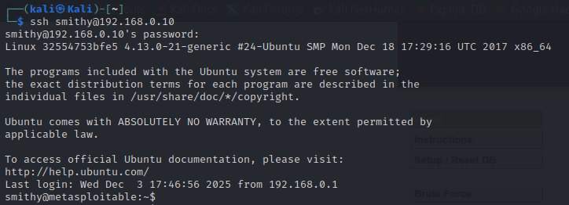

2.  Locate and open the flag file in the user's home directory.
```linux_ls-command
ls
# lists files in the current directory
```

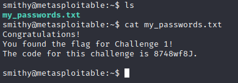

#### Challenge checkpoint 2

The name of the file with the code is "**`my_passwords.txt`**".

#### Challenge checkpoint 3

The message contained in the file says:  
```
” Congratulations!

You found the flag for Challenge 1!

The code for this challenge is 8748wf8J. “ 
```
  
The challenge code is "**`8748wf8J`**".

### Proposed SQL attack remediation

1.  ***Use prepared statements and parameterized quaries, whcih will
    enable the database to threat the inputs as data, and not executable
    code.***

2.  ***Implement strict validation on all user inputs, allowing only
    expected characters, formats, and lengths and rejecting anything
    that doesn’t conform to the defined rules.***

3.  ***Use the Principle of Least Privilege by granting database users
    only the minimum necessary permissions required for the task they
    have to perform.***

4.  ***Install or setup a Web Application Firewall (WAF) to act as an
    additional layer of defence for monitoring and filtering malicious
    requests like SQL injection commands before they reach the
    application.***

5.  ***Perform regular security audits and Vulnerability scanning to
    catch or detect potential SQL injection vulnerabilities and
    implement the necessary patches before threat actors identify and
    exploit them.***


## Challenge 2: Web Server Vulnerabilities 

#### _Objective:_
Find vulnerabilities on an HTTP server.
Misconfiguration of a web server can allow for the listing of 
files contained in directories on the server. Use the necessary 
tools to perform reconnaissance to find the vulnerable directories.

Locate the flag file in a vulnerable directory on a web server.

### Step 1: Initial setup

1.  If not already, log into the server at 10.5.5.12 with the **admin /
    password** credentials.

    

2.  Set the application security level to low.

    

### Step 2: From the results of your reconnaissance, determine which directories are viewable using a web browser and URL manipulation.

Perform reconnaissance on the server to find directories where indexing
was found.
_(In this lab I performed two different reconnaissance to compliment and verify each other's results)_

```directory_enum_using_nmap
sudo nmap -p 80 --script http-enum.nse 10.5.5.12
```
`# sudo nmap -p <scanning_port_num> --script <http-enum.nse script> <target ip>`

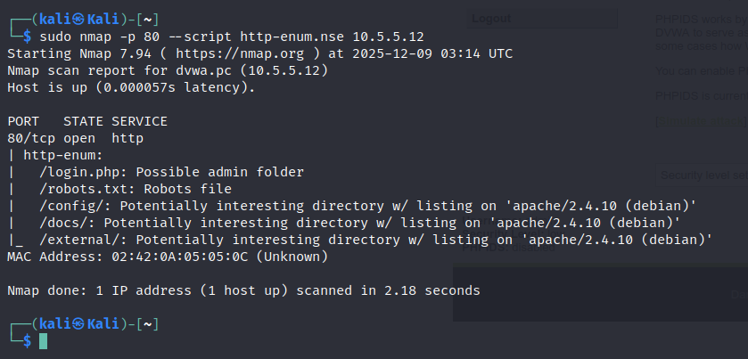

```directory_enum_using_gobuster
gobuster dir -u http://10.5.5.12 -w /usr/share/dirb/wordlists/common.txt
```

`# `

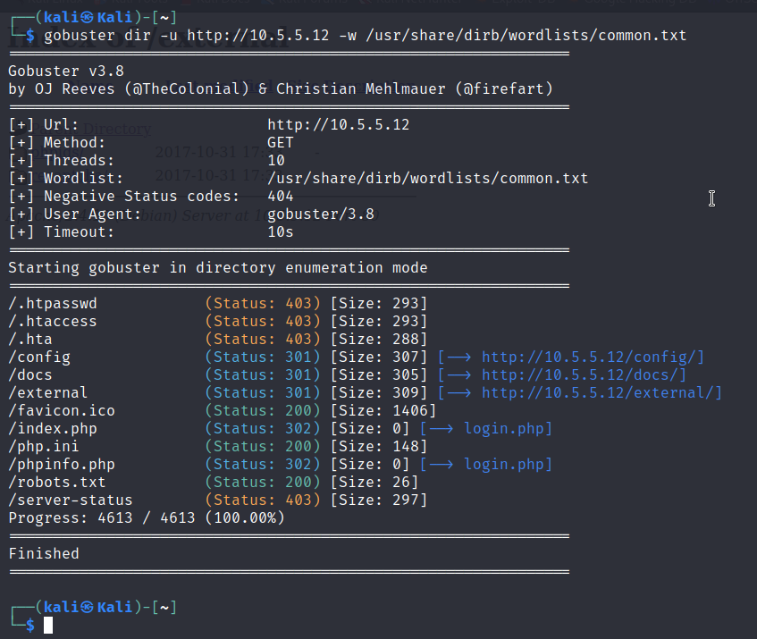

#### Challenge 2 checkpoint 1
The directories that can be accessed through the web browser to list the files and subdirectories that they contain include
***/config/, /docs/ and /external/***

### Step 3: View the files contained in each directory to find the db_form.html file.

Create a URL in the web browser to access the viewable subdirectories.
Find the file with the code for Challenge 2 located in one of the
subdirectories.

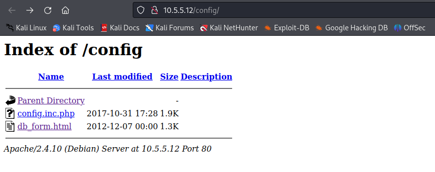

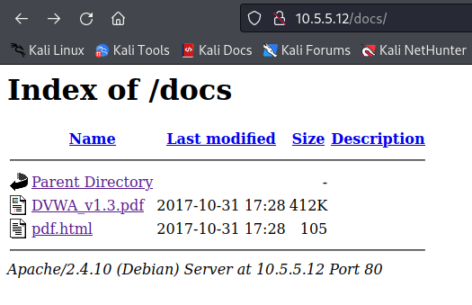

#### Challenge 2 checkpoint 2
The two subdirectories that can be looked into for the flag file are
- ***/config*** subdirectory
- ***/docs*** subdirectory.
`(They are the most likely subdirectories to hold sensitive files like the db_form.html file)`
#### Challenge 2 checkpoint 3
The filename with the Challenge 2 code is the ***`db_form.html`***.
#### Challenge 2 checkpoint 4
The subdirectory that held the flag file is the ***`/config`*** subdirectory.
#### Challenge 2 checkpoint 5
The message contained in the flag file:
```flag_file_message
“Great Work! You found the flag file
for Challenge 2!”

The code for this flag is: aWe-4975
```

The code that you find in the file is **`aWe-4975`**.

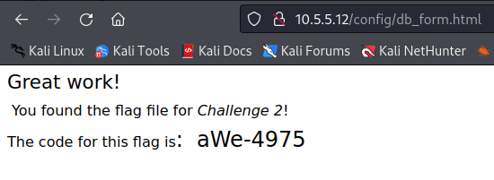

### Proposed directory listing exploit remediation.

1.  ***Restrict access to sensitive directories using proper file
    permissions.***

2.  ***Avoid storing backup or configuration files in publicly
    accessible locations.***

## Challenge 3: Exploit open SMB Server Shares

#### _Objective:_
Discovering if there are any unsecured shared directories located 
on an SMB server in the 10.5.5.0/24 network. Use tools know 
to you to find the drive shares available on the servers.

### Step 1: Scan for potential targets running SMB.

Use scanning tools to scan the 10.5.5.0/24 LAN for potential targets for
SMB enumeration.

```smb_server_vulnerability
# Performed an nmap host scan on the known smb ports 139 & 445 to expose vulnerable SMB server

sudo nmap -p 139,445 -sV 10.5.5.0/24
```
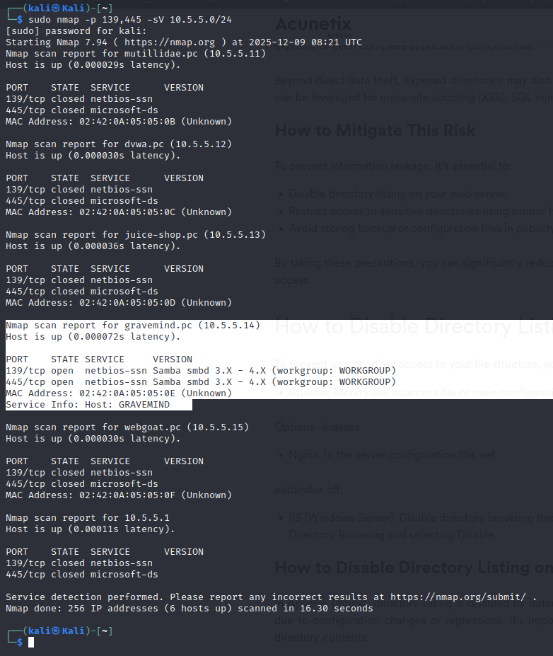

#### Challenge 3 checkpoint 1
The host Gravemind with IP Address ***`10.5.5.14`*** has open ports on ***`139`*** and
***`445`*** all running SMB services.

### Step 2: Determine which SMB directories are shared and can be accessed by anonymous users.

Use a tool to scan the device that is running SMB and locate the shares
that can be accessed by anonymous users.

```smb_dir_scan
# Again nmap with a smb enumeration script is used to perform this scan.
 
sudo nmap -p 139,445 --script smb-enum-shares.nse 10.5.5.14
```
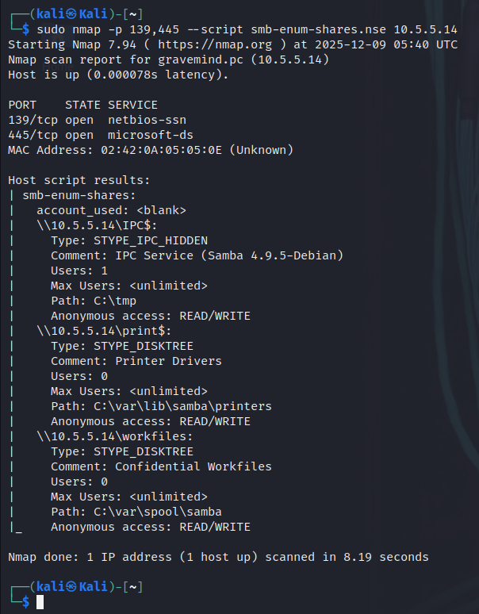

#### Challenge 3 checkpoint 2
The listed shares on the SMB server are: 
- [\\10.5.5.14\IPC\$,](\\\\10.5.5.14\\IPC$,)
- [\\10.5.5.14\print\$](\\\\10.5.5.14\\print$) 
- [\\10.5.5.14\workfiles.](\\\\10.5.5.14\\workfiles.)

**They are all accessible without a valid user login (Anonymous access)**

### Step 3: Investigate each shared directory to find the file.

Use the SMB-native client to access the drive shares on the SMB server.
Use the dir, ls, cd, and other commands to find subdirectories and files.

```SMB_client_drive_shares_access
# Respectively access the listed shares found.
# Press enter when password is requested

smbclient //10.5.5.14/workfiles

smbclient //10.5.5.14/IPC$

smbclient //10.5.5.14/print$
```

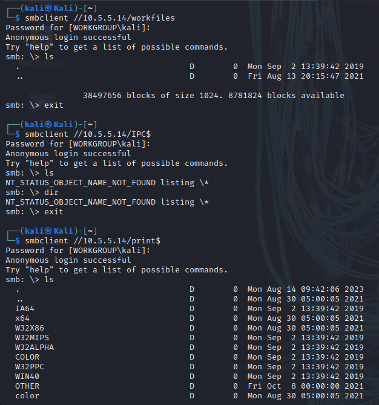

Locate the file with the Challenge 3 code. Download the file and open it
locally.

```finding_flag_file
# Both /workfiles and /IPC$ dirs didn't lead us anywhere but /print$ cd into it's dir until we find flag file.

smbclient //10.5.5.14/print$

dir

cd OTHER\

get sxij42.txt

exit
```

```display_flag_file
# From current directory, we ls and cat flag file

ls

cat sxij42.txt
```
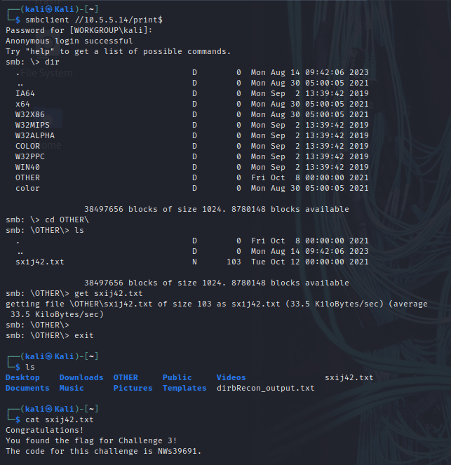

#### Challenge 3 checkpoint 3
The flag file was found in the ***`print\$ share`*** under the ***`subdirectory OTHER`***.
#### Challenge 3 checkpoint 4
The name of the file with Challenge 3 code is called ***`sxij42.txt`***.
#### Challenge 3 checkpoint 5
The challenge 3 code is **`NWs39691`**.

### Proposed SMB attack remediations.

1.  ***Ensure that all SMB-enabled devices, run the latest SMB versions and
    patches and also disable older versions of SMBs like SMBv1 , which
    is more vulnerable and use SMBv2 or SMBv3 which are more secure.***

2.  ***Implement strong password policies like regular password changes
    or updating and encourage the use of multi-factor authentication
    (MFA).***

## Challenge 4: Analyze a .pcap file to find information.

#### _Objective:_
As part of your reconnaissance effort, your team captured traffic using
Wireshark. The capture file, **SA.pcap**, is located in the **Downloads** subdirectory 
within the **kali** user home directory.

###  Step 1: Find and analyze the SA.pcap file.

Analyze the content of the PCAP file to determine the IP address of the
target computer and the URL location of the file with the Challenge 4 code

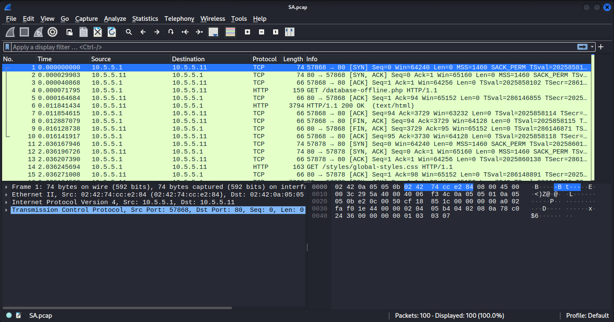

#### Challenge 4 checkpoint 1
The IP address of the target computer is ***10.5.5.11***.
#### Challenge 4 checkpoint 2
The directories on the target that are revealed in the PCAP include:
- ***/data***, 
- ***/includes***, 
- ***/passwords***, 
- ***/webservices***.  
  
_(This was achieved using the filter `http` and base on the GET request info from the 
Host IP and HTTP response from the target IP, I was able to tell which was a directory and which was not)._  
  
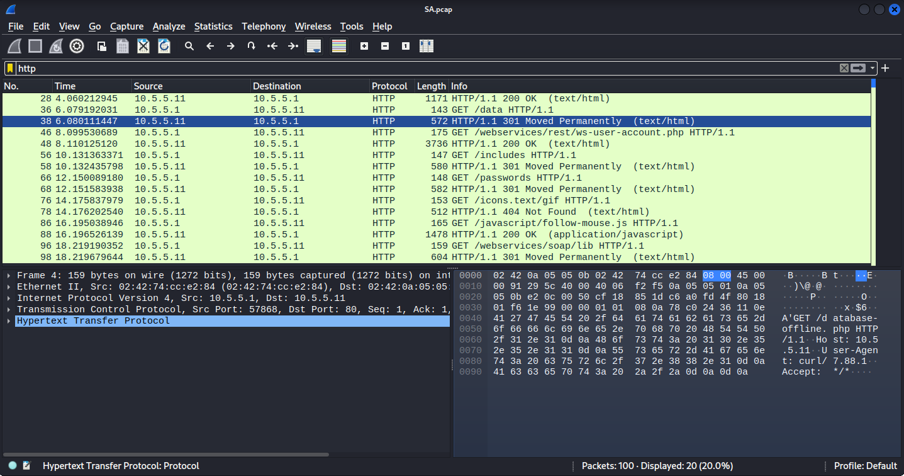

### Step 2: Use a web browser to display the contents of the directories on the target computer.

Use a web browser to investigate the URLs listed in the Wireshark
output. Find the file with the code for Challenge 4.

_(This can be done one at a time by using **`http://10.5.5.11/<specific_directory>`**)_
***Hint: _One of the directory paths gives you a hint on where to look, making you your work easy._***

#### Challenge 4 checkpoint 3
The URL of the file is _[http://10.5.5.11/data/](http://10.5.5.11/data/.)_
#### Challenge 4 checkpoint 4
The content of the file is ***`an xml of Employee data`***.
#### Challenge 4 checkpoint 5
The message contained in the record for Employee ID 0 is 
```xml_employee_data
UserName “Flag” 
Password “Here is the Code for Challenge 4!"
Signature “21z-1478K”.
```  
  
The code associated to the user is **`21z-1478K`**.

### Propose remediation that would prevent file content from being transmitted in clear text.

1.  ***Use Secure or replace insecure protocols with industry-standard,
    secure alternatives that use TLS or SSL through TLS so that data is
    encrypted during transmission. e.g use HTTPS over HTTP, SFTP over
    FTP and SSH over Telnet.***

2.  ***Perform regular audits and monitoring of network traffic to
    identify and remediate potential vulnerabilities or suspicious
    activities.***

```completed!!
											Congratulations!
```
